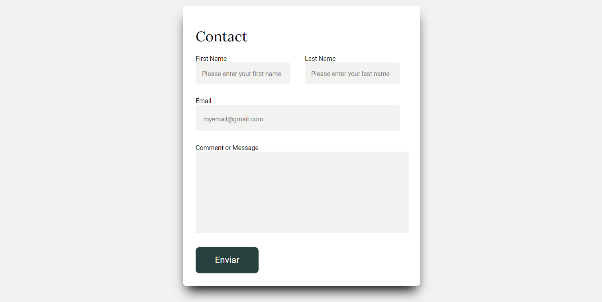

# Description

This form integrates with a MySQL table, automatically recording any submitted information into the database table. It is perfect for capturing customer 
contact details or allowing them to send messages. The form features a minimalist design, emphasizing efficiency and elegance.

# Main Features 
- HTML and CSS
- PHP
- MySQL
- Minimalist Design
- Responsive

# Screenshot

## Contact Page

## Error Message and Sucess Message

